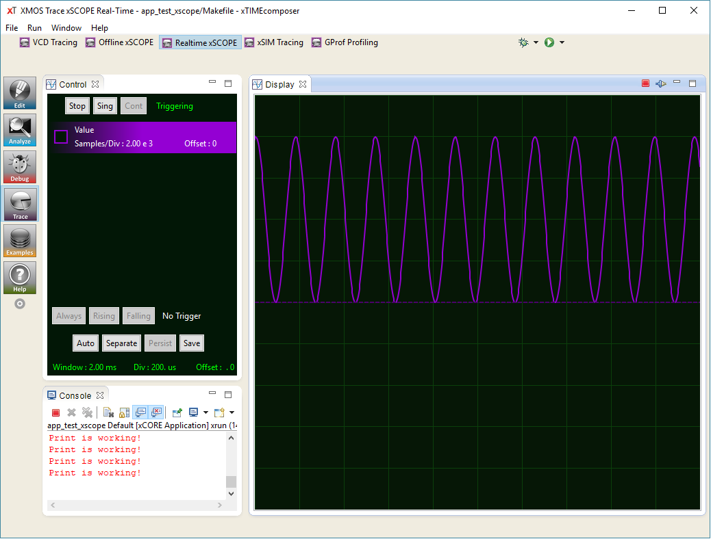

====================
Simple xSCOPE  Demo
====================

.. contents:: In this document
    :backlinks: none
    :depth: 3

This is a simple example on how to use xSCOPE and debug prints forwarding via xSCOPE.
While running, it should display a sinusoidal wave in xTIMEcomposer's xSCOPE tab.

This app was originally provided by XMOS as an `Application Note`_.

.. cssclass:: github

  `See Application on Public Repository <https://github.com/synapticon/sc_somanet-base/tree/master/examples/app_test_xscope>`_

Hardware setup
===============

You need a SOMANET node consisting of at least a SOMANET CORE board connected to you PC via the XMOS XTAG adapter.

.. note::  In case you are using a :ref:`SOMANET CORE C22 <core_c22>` module, xSCOPE has to be activated by a :ref:`hardware switch <core_debug_xscope>` 

Quick how-to
============

1. Configure your Makefile inside app_test_xscope directory with your SOMANET Core Board. e.g.

	::

		TARGET = SOMANET-C22

2. In the main.xc, include the board support package for your Core Board. e.g.

	::

		#include <CORE_C22-rev-a.bsp>

3. Enable your Real-Time xSCOPE in your xTIMEcomposer Run Configuration.

* Open Run → Run Configurations in the upper menu

* Double click xCORE Application

* In the Main tab select C/C++ Application → Search Project… “app_test_xscope_Debug.xe”

* In the XScope tabe enable "Real-Time Mode"

4. Press "Run"!

5. You should see this

6. If you don’t see one of these windows, click on “Window/Show View”

7. In case you see only half the sine, use your mouse to change the scaling by hovering over “Sample/Div” and scrolling

.. _`Application Note`: https://www.xmos.com/download/private/AN00196%3A-Getting-Started-with-Real-Time-xSCOPE-in-xTIMEcomposer-Studio%281.0.0rc1%29.pdf
