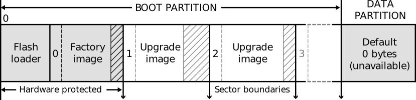

.. _enet_overview_label:

Module Flash Service
===============

Module Flash Service provides a server, which managed the flash content and is responsible for the flash access (writing/reading).

IMPORTANT: It should not be allowed any other task to get access to the flash memory.

Flash format
--------------

By default the flash memory consist of just a boot partition. To store common data it is recommened, to create data partition.

For further information take a look in the PDF `Design and manufacture systems with flash memory`_ by XMOS.

	
.. _Design and manufacture systems with flash memory: https://download.xmos.com/XM-000949-PC-9.pdf?auth=WzAsIjkxLjE4Ljg1LjExIiwxNDUwMzQxMzA5LCJYTS0wMDA5NDktUEMtOS5wZGYiXQ==
