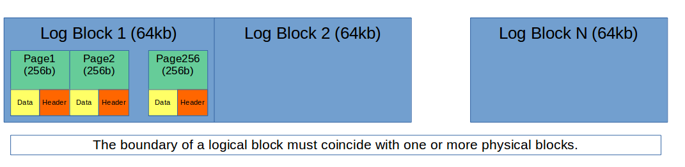
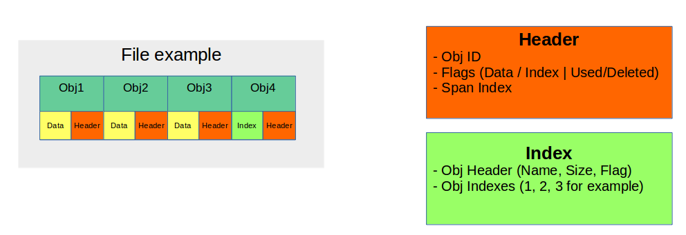
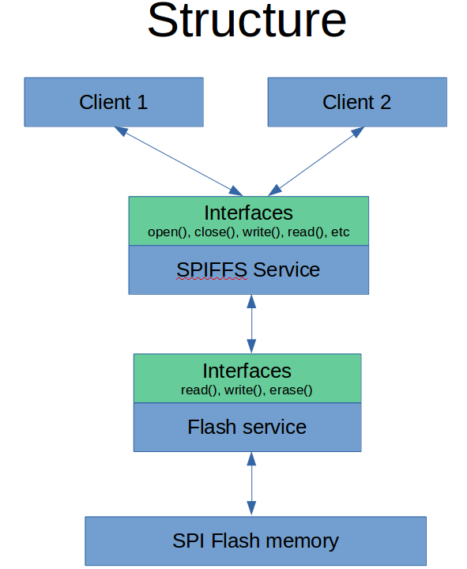

SPIFFS Service
==============
SPIFFS Service provides a server, which managed the SPI Flash File System.

**SPIFFS (SPI Flash File System)**

Spiffs is a file system intended for SPI NOR flash devices on embedded targets.
Spiffs is designed with following characteristics in mind:

 - Small (embedded) targets, sparse RAM without heap
 - Only big areas of data (blocks) can be erased
 - An erase will reset all bits in block to ones
 - Writing pulls one to zeroes
 - Zeroes can only be pulled to ones by erase
 - Wear leveling

Spiffs is allocated to a part or all of the memory of the SPI flash device. 
This area is divided into logical blocks, which in turn are divided into 
logical pages. The boundary of a logical block must coincide with one or more 
physical blocks.

A logical block is divided further into a number of logical pages. A page 
defines the smallest data holding element known to spiffs.

The service provides access to all functions of the spiffs - writing/reading/erasing of files and much more. For low-level access to flash memory, the module_flash_service is required.

How to use
==========
.. important:: We assume that you are using :ref:`SOMANET Base <somanet_base>` and your app includes the required **board support** files for your SOMANET device

 1. module_flash_service should be installed.

 2. Add the SPIFFS Service module to your app Makefile.

 ::

    USED_MODULES = module_flash_service module_spiffs

 3. Include the SPIFFS Service header spiffs_service.h in your app.

 4. Inside your main function, instantiate the interfaces array for the Service-Clients communication.

 5. Optionally, instantiate the shared memory interface.

 6. At whichever other core, now you can perform calls to the SPIFFS Service through the interfaces connected to it.

    .. code-block:: c

#include <flash_service.h>

#ifdef XCORE200
    #include <quadflash.h>
#else
    #include <flash.h>
#endif

#include <spiffs_service.h>

#define MAX_FLASH_DATA_INTERFACES 2
#define MAX_SPIFFS_INTERFACES 2

//---------SPI flash definitions---------

// Ports for QuadSPI access on explorerKIT.
fl_QSPIPorts ports = {
PORT_SQI_CS,
PORT_SQI_SCLK,
PORT_SQI_SIO,
on tile[0]: XS1_CLKBLK_1
};

int main(void)
{
  FlashDataInterface i_data[MAX_FLASH_DATA_INTERFACES];
  FlashBootInterface i_boot;
  SPIFFSInterface i_spiffs[MAX_SPIFFS_INTERFACES];

  par
  {
    on tile[0]:
    {
        flash_service(ports, i_boot, i_data, 1);
    }

    on tile[1]:
    {
        spiffs_service(i_data[0], i_spiffs, 1);
    }
  }

  return 0;
}

API
===

Definitions
------------

.. doxygendefine:: MAX_FILENAME_SIZE
.. doxygendefine:: MAX_DATA_BUFFER_SIZE

Types
-----

.. doxygenstruct:: spiffs_stat

Service
-------

.. doxygenfunction:: spiffs_service

Interface
---------

.. doxygeninterface:: SPIFFSInterface

